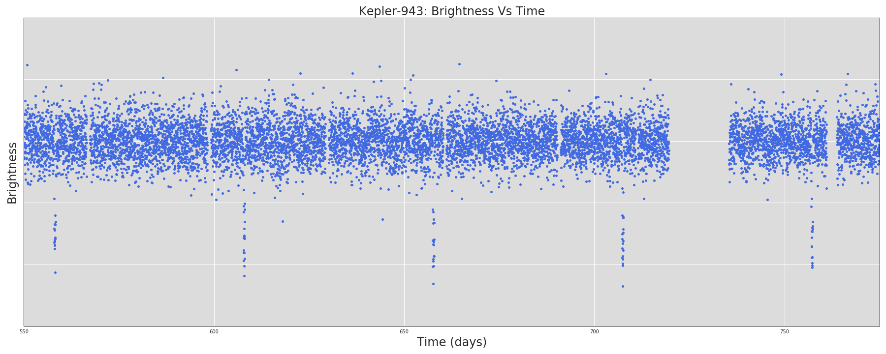
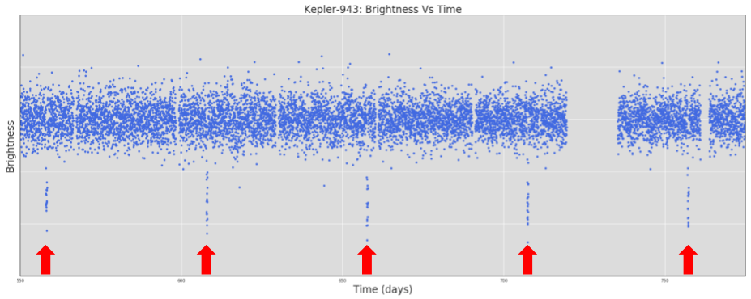
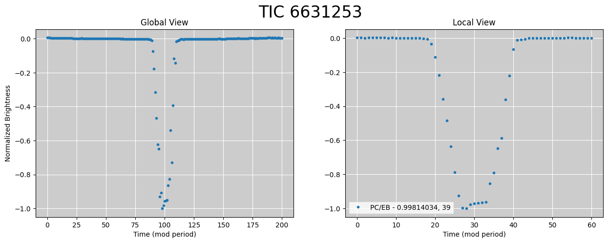

# Astronet Neural Networks for Windows: A Neural Network for Analyzing TESS Data


## Background

This project contains TensorFlow models and data processing code for identifying exoplanets from astrophysical light curves. 
This model is derived from Liang Yu's code. For a complete background on how this model works, see [Shallue & Vanderburg's paper](http://adsabs.harvard.edu/abs/2018AJ....155...94S) in
as well as [Liang Yu's paper](https://ui.adsabs.harvard.edu/abs/2019AJ....158...25Y/abstract) in *The Astronomical Journal*.
Both the triage and vetting networks are included in this project.

For shorter summaries, see:

* ["Earth to Exoplanet"](https://www.blog.google/topics/machine-learning/hunting-planets-machine-learning/) on the Google blog
* [This blog post](https://www.cfa.harvard.edu/~avanderb/page1.html#kepler90) by Andrew Vanderburg
* [This great article](https://milesobrien.com/artificial-intelligence-gains-intuition-hunting-exoplanets/) by Fedor Kossakovski
* [NASA's press release](https://www.nasa.gov/press-release/artificial-intelligence-nasa-data-used-to-discover-eighth-planet-circling-distant-star) article

## Bibliography
Original papers from which this project is largely derived:

Yu, L. et al. (2019). Identifying Exoplanets with Deep Learning III: Automated Triage and Vetting of TESS Candidates. *The Astronomical Journal*, 158(1), 25.

See also the original Shallue & Vanderburg paper:

Shallue, C. J., & Vanderburg, A. (2018). Identifying Exoplanets with Deep
Learning: A Five-planet Resonant Chain around Kepler-80 and an Eighth Planet
around Kepler-90. *The Astronomical Journal*, 155(2), 94.

Full text available at [*The Astronomical Journal*](http://iopscience.iop.org/article/10.3847/1538-3881/aa9e09/meta).

## Code Directories

[astronet/](astronet/)

* [TensorFlow](https://www.tensorflow.org/) code for:
  * Downloading and preprocessing TESS data.
  * Building different types of neural network classification models.
  * Training and evaluating a new model.
  * Using a trained model to generate new predictions.

[light_curve_util/](light_curve_util)

* Utilities for operating on light curves:
  * Reading TESS data from `.fits` files.
  * Phase folding, splitting, binning, etc.
* In addition, some C++ implementations of light curve utilities are located in
[light_curve_util/cc/](light_curve_util/cc).

[third_party/](third_party/)

* Utilities derived from third party code.

## Setup

### Dependencies

First, install the following required packages:

* **Anaconda Navigator** ([instructions](https://docs.anaconda.com/anaconda/install/windows/))
* **PIP** ([instructions](https://pip.pypa.io/en/stable/installation/))
* **Python Version 3.7** ([instructions](https://stackoverflow.com/questions/61491893/i-cannot-install-tensorflow-version-1-15-through-pip))
* **TensorFlow** ([instructions](https://docs.anaconda.com/anaconda/user-guide/tasks/tensorflow/))
  - **TensorFlow V1.15** ([instructions for downgrading](https://www.tensorflow.org/install/pip))
* **Pandas** ([instructions](https://pandas.pydata.org/pandas-docs/stable/getting_started/install.html))
* **NumPy** ([instructions](https://docs.scipy.org/doc/numpy/user/install.html))
* **AstroPy** ([instructions](http://www.astropy.org/))
* **PyDl** ([instructions](https://pypi.python.org/pypi/pydl))
* **Bazel** ([instructions](https://docs.bazel.build/versions/main/install-windows.html))
* **Windows Subsystem for Linux** ([instructions](https://docs.microsoft.com/en-us/windows/wsl/install))

### Bazel Installation

Since Bazel can be a bit difficult to install, a brief section is devoted to the installation process for Bazel. 

Bazel can be installed by following the instructions found at the link provided under the Dependencies heading. In step 3, install the latest version of Bazel, which is 4.2.2. 
at the time of writing. Next, download the file named "bazel-4.2.2-windows-x86_64.exe," rename it "bazel.exe," and copy it in the Astronet-Triage-master and Astronet-Vetting- 
After step 4, add the path to this file to the PATH variable with the following command:

```
setx PATH "i.e. path to bazel binary;%PATH%"
```

```
set PATH = i.e. path to Bazel binary;%PATH%	
```

Before continuing onto step 5 and confirming that Bazel has been properly installed, install [MSYS2](/https://www.msys2.org/) and define the BAZEL_SH environment variable as shown [here](https://docs.bazel.build/versions/main/install-windows.html) under the section titled "Bazel doesn't find Bash or 
bash.exe." 

### Installation Troubleshooting

Check [here](https://github.com/bazelbuild/bazel/issues) for troubleshooting Bazel.

### Testing Programs
To test the code, open the Astronet-Triage-master folder in the Command Prompt and run Bazel with
the following commands:
```
bazel test astronet/... --test_arg=--test_srcdir=/path_to_Astronet-Triage-master_directory/Astronet-Triage-master/Astronet-Triage-master/
bazel test light_curve_util/... --test_arg=--test_srcdir=/path_to_Astronet-Triage-master_directory/Astronet-Triage-master/Astronet-Triage-master/
bazel test third_party/... --test_arg=--test_srcdir=/path_to_Astronet-Triage-master_directory/Astronet-Triage-master/Astronet-Triage-master/
```

If these commands are successfully executed, the next step is to download the TESS files. 

### Downloading TESS Data

A *light curve* is a plot of the brightness of a star over time. We will be focusing on light curves produced by the TESS space telescope. 
An example light curve (produced by Kepler) is shown below.


*Image taken from [Chris Shallue's Exoplanet ML repository](https://github.com/google-research/exoplanet-ml/blob/master/exoplanet-ml/astronet/README.md#walkthrough)*

To train a model to identify planets in TESS light curves, you will need a training set of labeled *Threshold Crossing Events* (TCE). 
A TCE is a periodic signal that has been detected in a light curve, and is associated with a *period* (the number of days between each occurrence of the detected signal),
a *duration* (the time taken by each occurrence of the signal), an *epoch* (the time of the first observed occurrence of the signal), and additional
metadata like the signal-to-noise ratio. An example TCE is shown below. The labels are verified ground truth classifications that indicate which
TCEs in the training set are actual planets signals and which are caused by other phenomena.


*Image taken from [Chris Shallue's Exoplanet ML repository](https://github.com/google-research/exoplanet-ml/blob/master/exoplanet-ml/astronet/README.md#walkthrough)*

Since the data which will form the basis for the training set will be selected by the user, the relevant TESS data must be downloaded from the [Mikulski Archive for Space 
Telescopes](https://archive.stsci.edu/missions-and-data/tess). This site contains all of the data relevant to the TESS mission. In order to download the .csv file for all of the 
recorded TCEs in the desired sector, go [here](https://archive.stsci.edu/tess/bulk_downloads.html) and click on the TCE Bulk Downloads link. From there, pick the desired sector 
and download the .csv file by clicking on the link next to the sector number.    

Next, the TIC IDs of the TCEs must be copied and pasted into a separate .txt file. This .txt file will be named sector-x-yyy.txt where x identifies the sector number of the TCE 
file. 

After saving the .txt file, the executable file must be created by navigating to the astronet/data folder and adjusting the BUILD file. This BUILD file is directly responsible 
for the creation of the executable files which will be run in WSL. For more information on how the BUILD files work check [here](https://docs.bazel.build/versions/main/build-ref.html). 
Add the following lines to the BUILD file:

```
    py_binary(
    name="make_catalog",
    srcs=["make_catalog.py"],
)
```
```
py_binary(
    name="make_empty_catalog",
    srcs=["make_empty_catalog.py"],
)
```

Once completed, save the file and navigate to back to the astronet folder and run Bazel with the following command:

```
bazel build data/...
```

This should produce executable files for the "make_catalog" and "make_empty_catalog" python files. Since the user will be working with data from an arbitrary sector, the 
"make_empty_catalog" file will have to be executed first and can be run by navigating to the Astronet-Triage-master/bazel-bin/astronet/data folder in WSL and running the 
following command:

```
./make_empty_catalog.exe --base_dir=[wherever you text file is] --input sector-[Number of sector from which file will have to be executed]-yyy.txt --save_dir=[wherever you want to save the output]
```

Since this python file searches for the sector number by splitting the file path by hyphens, depending on the folder names the user has defined the index of the arrays will have 
to be manually changed. After this the data folder will have to be recompiled and finally run using the previous command in WSL again. This should create a .csv file named 
sector-x-all.csv containing the TIC ID, junk disposition and sector number in three separate columns.

In order to fill in the remaining columns, the "make_catalog" executable must be run using the following command:

```
./make_catalog.exe --input sector-[Number of sector from which file will have to be executed]-all.csv  --tcestatfile=[Name of TCE file downloaded from MAST] --num_worker_processes=1 --base_dir=[wherever the .csv file is located] --out_name=[whatever you want to name the file with .csv attached to the end]
```

This will create a .csv file with most of the columns filled in. 

Prior to analyzing the data in the .csv file, download the light curve data files. Click [here](https://archive.stsci.edu/tess/bulk_downloads/bulk_downloads_ffi-tp-lc-dv.html) 
and download the light curve files by clicking the link next to the relevant sector number for your data collection. Next, run the tess_shell_adjust.py file from the Anaconda 
Prompt by entering the following command:

```
python tess_shell_adjust.py --input_csv_file=[Path to the completed .csv file] --input_sh_file=[Path to the downloaded shell file with light curve download commands] --output_sh_file=[Path where output file will be placed upon completion of the program as well as name of the output file]
```

This will create a shell file which should have a fraction of the download commands in the original shell file. Run this shell file in WSL by navigating to astronet/tess/sector-x and typing the following:

```
./[name of the .sh file]
```

This will run a script which should have all of the necessary files downloaded in the same folder as the shell script. 

### Process TESS Data

In order to properly process the data with TensorFlow, the user needs to create training data in TFRecord format from the .csv file created above. TFRecord format consists of a 
set of sharded files containing serialized `tf.Example` [protocol buffers](https://developers.google.com/protocol-buffers/). 

The command below will generate a set of sharded TFRecord files for the TCEs in
the training set. Each `tf.Example` proto will contain the following light curve
representations:

* `global_view`: Vector of length 201: a "global view" of the TCE.
* `local_view`: Vector of length 81: a "local view" of the TCE.

In addition, each `tf.Example` will contain the value of each column in the input TCE CSV file, including transit and stellar parameters.

To generate the training set:

```bash
# Filename and path containing the CSV file of TCEs in the training set.
TCE_CSV_FILE="astronet/tces.csv"

# Directory to save output TFRecord files into.
TFRECORD_DIR="astronet/tfrecord"

# Directory where light curves are located.
TESS_DATA_DIR="astronet/tess/"
  
# Run without bazel
./generate_input_records.exe \
--input_tce_csv_file=${TCE_CSV_FILE} \
--tess_data_dir=${TESS_DATA_DIR} \
--output_dir=${TFRECORD_DIR} \
--num_worker_processes=1 \
--make_test_set
```

Note that the same multiprocessing issue from earlier still applies here. Additionally, the sector number in both the tess_io.py and preprocessing.py programs will have to be 
changed prior to running this command.

### Make Predictions

Run the following:

```bash
# Make a directory for plots
mkdir astronet/plots
SAVE_DIR=astronet/plots

# Generate a prediction for a list of new TCEs.
python astronet/batch_predict.py \
  --model_dir=${MODEL_DIR} \
  --tfrecord_dir=${TFRECORD_DIR} \
  --suffix=yyy \
  --average \
  --plot \
  --save_dir=${SAVE_DIR}
```


If the `--plot` argument is included, you must also include a `--save_dir` argument. Plots of the global and local views of TCEs in the test set will be saved under that 
directory.

The plot of the light curve should look something like this:



If you trained an ensemble of models and want to use model averaging, include a `--average` argument and make sure `${MODEL_DIR}` is set to the directory that contains the 10 
subdirectories. If there's no `--average` argument, `${MODEL_DIR}` is just the directory containing your single model.

The output of this step is a file called `prediction_yyy.txt` saved in the bazel-bin/astronet folder. This file contains the TIC ID of each object in your input list, and the 
model's prediction of the object being a plausible planet candidate.

### Vetting Process

In order to properly refine the results obtained from the Triage version of the neural network, the user needs to follow the same steps for the vetting version of the neural 
network. The only difference in the vetting network is that when using `./batch_predict.exe` command to create a list of predictions for the list of TCEs downloaded from MAST 
the proper averaged model is located under the `astronet/models_final/model_dc_se` folder. This model vets candidates by taking into account secondary eclipses and depth 
changes. 

### Final Checks and Outreach

Planetary candidates processed by both triage and vetting networks are likely to be correct but in order to legitimize their classification, a series of steps listed 
[here](http://www.hughosborn.co.uk/category/exoplanet-detection/) can be taken to truly verify candidates before emailing a professional astronomer about your findings. 

Also, check [here](https://exofop.ipac.caltech.edu/tess/) by typing the TIC ID into the Single Target Lookup box to verify that the candidate has not already been identified 
as a planetary candidate. 
